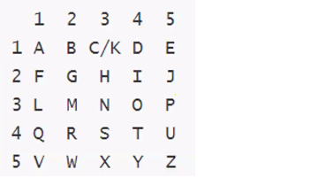

# misc杂项
## 编码转换
### 进制码
### BASE64
使用python
base64,base58,base32,base16
import base64

### 图片码
- 条形码（barcode）
    是将宽度不等的多个黑条和空白，按照一定的编码规则排列，用以表达一组信息的图形标识符。常见的条形码是由反射率相差很大的黑条（简称条）和白条（简称空）排成的平行线图案。
- 二维码
    维条码/二维码（2-dimensional bar code）是用某种特定的几何图形按一定规律在平面（二维方向上）分布的、黑白相间的、记录数据符号信息的图形；在代码编制上巧妙地利用构成计算机内部逻辑基础的“0”、“1”比特流的概念，使用若干个与二进制相对应的几何形体来表示文字数值信息，通过图象输入设备或光电扫描设备自动识读以实现信息自动处理：它具有条码技术的一些共性：每种码制有其特定的字符集；每个字符占有一定的宽度；具有一定的校验功能等。同时还具有对不同行的信息自动识别功能、及处理图形旋转变化点。

工具：010editer
题型：
- 二维码读取内部文件，观察编码
- 二维码反色（黑变白）
- 二维码修补，可以使用PS进行修补（比如把三个标识码来进行遮挡，修补就可以用PS）
- PDF417码（结合反色处理）

### ASCII
ASCII是基于拉丁字母的一套电脑编码系统，主要用于显示现代英语和其他西欧语言。它是最通用的信息交换标准，到目前为止共定义了128个字符。

0-31、127为ascii控制字符，32-126为ascii显示字符。

ASCII特征：\u接四个字符

### Unicode

Unicode是计算机科学领域里的一项业界标准，包括字符集、编码方案等。它为每种语言中的每个字符设定了统一并且唯一的二进制编码，以满足跨语言、跨平台进行文本转换、处理的要求。

-[工具](http:/Atool.chinaz.com/Tools/Unicode.aspx)

&#为编码标志

### Quoted-printable

口Quoted-printable可打印字符引用编码”、“使用可打印字符的编码”，我们收邮件，查看信件原始信息，经常会看到这种类型的编码。
一个等号”=”后跟随两个十六进制数字（0-9或A-F）表示该字节的数值。
测试链接：http://web.chacuo.net/charsetquotedprintable
=3Cmeta=20name=3D=22description=22=20flag=3D=22tidesec=22=20=2F=3E=0A

### 摩尔斯电码
摩尔斯电码是一种早期的数字化通信形式，但是它不同于现代只使用零和一两种状态的二进制代码，它的代码包括五种：点、划、点和划之间的停顿、每个字符之间短的停顿、每个词之间中等的停顿以及句子之间长的停顿。

二进制编码常出摩尔斯编码

### 敲击码
敲击码（Tap code）是一种以非常简单的方式对文本信息进行编码的方法。因该编码对信息通过使用一系列的点击声音来编码而命名，敲击码是基于5×5方格波利比奥斯方阵来实现的，不同点是是用K字母被整合到C中。

### url
是一种浏览器用来打包表单输入的格式。浏览器从表单中获取所有的name和其中的值，将它们以name/value参数编码（移去那些不能传送的字符，将数据排行等等）作为URL的一部分或者分离地发给服务器。
URL编码的特征为%，所有的URL编码都是由%XX组成的。

### XXencode
XXencode，也是一个二进制字符转换为普通打印字符方法。跟UWencode编码原理方法很相似，唯独不同的是可打印字符不同。
测试链接：http://tool.chinaz.com/Tools/Unicode.aspx KjhasxglxpxA8NalVNrho0KFZQqJXTE++

### shellcode
shellcode是一段用于利用软件漏洞而执行的代码，shellcode为16进制的机器码，因为经常让攻击者获得she11而得名。shellcode常常使用机器语言编写。可在暂存器eip溢出后，塞入一段可让CPU执行的shellcode机器码，让电脑可以执行攻击者的任意指令。

### 曼彻斯特编码

从低到高为1，从高到低为0

### Npiet
特点文档是像素点的图片
测试链接：https://www.bertnase.de/npiet/npiet-execute.php

### Ook
密文由(OOk,OOk!,OOk?)组成
### brainfork
### jother
密文为8个字符！+（）[]{}
在浏览器中console执行即可

